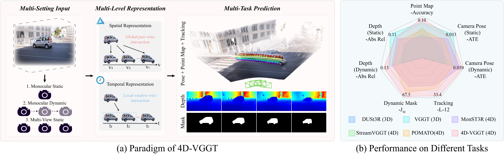

<div align="center">

<h1>[ECCV 2026] 4D-VGGT: A SpatioTemporal Foundation Model for Dynamic Scene Geometry Estimation</h1>

<p>
  <a href="https://media.eventhosts.cc/Conferences/ECCV2026/pdfs/1131.pdf"></a>
  <a href="https://arxiv.org/abs/2511.18416"></a>
</p>

<p>
  <a href="https://scholar.google.com.hk/citations?user=LCNXgmAAAAAJ&hl=zh-CN">Haonan Wang</a><sup>1</sup>,
  <a href="https://hyzhouboy.github.io/">Hanyu Zhou</a><sup>2,✉</sup>,
  <a href="https://scholar.google.com.hk/citations?user=DadbHdAAAAAJ&hl=zh-CN">Haoyue Liu</a><sup>1</sup>,
  <a href="https://scholar.google.com.hk/citations?user=5CS6T8AAAAAJ&hl=zh-CN">Luxin Yan</a><sup>1</sup>
</p>

<p>
  <sup>1</sup> Huazhong University of Science and Technology &nbsp;&nbsp;
  <sup>2</sup> National University of Singapore
</p>

<p><sup>✉</sup> Corresponding author</p>

</div>

## Overview




4D-VGGT mainly contains two parts: three main components: 1) **Multi-Setting Input.** We design an adaptive visual grid that enables our model to accommodate visual features from diverse camera configurations through attention masks. 2) **Multi-Level Representation.** We propose a cross-view global fusion module to learn the spatial representation between various views, and a cross-time local fusion to model the temporal representation along continuous time steps. 3) **Multi-Task Prediction.** We construct multiple task-specific heads and perform joint multi-task optimization to learn the corresponding spatiotemporal features for scene geometry. Under our unified framework, these components enable our model to utilize a shared spatiotemporal representation scheme to support diverse input configurations and accomplish a variety of visual tasks.

## Version 1.0

Version 1.0 is a geometry-only release containing the model definition and inference code for:

- Camera parameter estimation
- Depth estimation
- World-space point-map estimation

Dynamic-mask prediction, point tracking, evaluation code, and training code are not included in this release. The corresponding geometry-only checkpoint is available separately on Hugging Face and is loaded with an exact state-dictionary contract.

## News

- **2026-10-06:** Released the Version 1.0 geometry-only model, inference code, and weights.
- **2026-06-20:** Our paper was accepted by ECCV 2026.

## Installation

Version 1.0 contains the geometry-only inference package. Python 3.10 or later is required, and we recommend Linux with a CUDA-capable GPU. Create an isolated environment, install a CUDA-compatible PyTorch build, and then install this repository:

```bash
git clone https://github.com/Haonan-Wang-aurora/4D-VGGT.git
cd 4D-VGGT

conda create -n 4d-vggt python=3.10 -y
conda activate 4d-vggt

python -m pip install --upgrade pip
python -m pip install torch==2.3.1 torchvision==0.18.1 --index-url https://download.pytorch.org/whl/cu121
python -m pip install -r requirements.txt
python -m pip install -e .
```

This release contains camera, depth, and point-map inference only.

## Checkpoint

Download [`4d-vggt-geometry-v1.pt`](https://huggingface.co/Aurora03/4D-VGGT-models/resolve/main/4d-vggt-geometry-v1.pt) from Hugging Face and place it in `checkpoints/`.

## Inference

Provide either one image directory or an explicitly ordered list of image files:

```bash
python infer.py \
  --images /path/to/scene/images \
  --checkpoint checkpoints/4d-vggt-geometry-v1.pt \
  --output outputs/scene \
  --precision bf16
```

The command writes:

- `predictions.npz`: native pose encodings, decoded camera matrices, depth, confidence, point maps, and input images.
- `metadata.json`: input hashes, checkpoint hash, model configuration, tensor shapes, preprocessing settings, and runtime information.

Input images from a directory are processed in natural filename order. The output directory must not already exist.

## To-do List

- [x] Release the geometry-only model definition and inference code.
- [x] Publish the geometry-only checkpoint on Hugging Face.
- [ ] Release the remaining prediction heads and evaluation code.
- [ ] Release the training code.
- [ ] Release the training datasets.

## Citation

If you find this repository or our work useful, please cite the paper and consider giving the repository a star.

```bibtex
@inproceedings{wang20264d,
  title={4D-VGGT: A SpatioTemporal Foundation Model for Dynamic Scene Geometry Estimation},
  author={Wang, Haonan and Zhou, Hanyu and Liu, Haoyue and Yan, Luxin},
  booktitle={European Conference on Computer Vision},
  pages={112--134},
  year={2026},
  organization={Springer}
}
```

## Acknowledgements

4D-VGGT builds upon [VGGT](https://github.com/facebookresearch/vggt). We thank the VGGT authors and the open-source community for their contributions.
