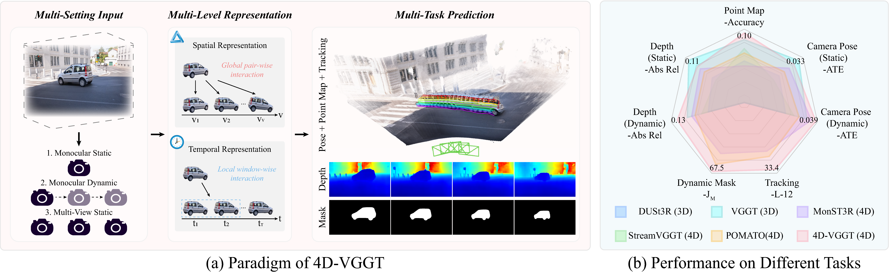

# [ECCV 2026] 4D-VGGT: A SpatioTemporal Foundation Model for Dynamic Scene Geometry Estimation

[Haonan Wang](https://scholar.google.com.hk/citations?hl=zh-CN&view_op=list_works&gmla=AH8HC4wel7f5UzHZm3NN_RHl9by4ODKcg12HuynxhWBbyyFpY3GCQp_wRryBPNSci76ZfoOB8_IDasu-vEEyzy9skm3tDy0&user=LCNXgmAAAAAJ) $^{1}$, [Hanyu Zhou](https://hyzhouboy.github.io/) $^{2✉}$,  [Haoyue Liu](https://scholar.google.com.hk/citations?hl=zh-CN&user=DadbHdAAAAAJ) $^1$, [Luxin Yan](https://scholar.google.com.hk/citations?user=5CS6T8AAAAAJ&hl=zh-CN) $^{1}$

$^1$ Huazhong University of Science and Technology  $^2$ National University of Singapore

$^✉$ Corresponding Author.

## Overview




Diff-ABFlow mainly contains two parts: Attention-ABF for feature fusion and MC-IDD for denoising. In Attention-ABF, we utilize the appearance-boundary complementarity to fuse frame and event. In MC-IDD, we first integrate time embedding, visual feature and motion feature in the TVM-MCA module based on multi-way cross-attention mechanism. Then in MGDD, we input the comprehensive feature and the optical flow of the current time step into multiple GRUs with memory slots for iterative denoising. We repeatedly run MC-IDD a certain number of times on the noisy optical flow to obtain the clear optical flow.

## News

2026.06.20: Our paper is accepted by ECCV 2026. 


## Citation

If you find this repository/work helpful in your research, welcome to cite our paper and give a ⭐.

```
@article{wang20254d,
  title={4D-VGGT: A General Foundation Model with SpatioTemporal Awareness for Dynamic Scene Geometry Estimation},
  author={Wang, Haonan and Zhou, Hanyu and Liu, Haoyue and Yan, Luxin},
  journal={arXiv preprint arXiv:2511.18416},
  year={2025}
}
```

